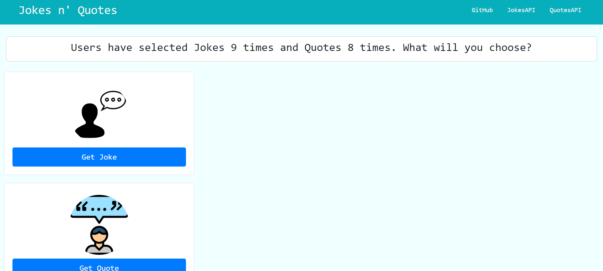
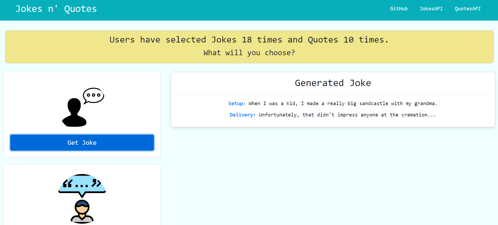

# Joke & Inspirational Quotes Generator Dashboard

## Overview
This project is a simple web dashboard that allows users to generate jokes and Inspirational quotes using external APIs. It features a clean and responsive design, making it easy for users to interact with the application.

## Table of Contents
- [Features](#features)
- [Screenshots](#screenshots)
- [Technologies](#technologies)
- [Installation](#installation)
- [Usage](#usage)
- [APIs](#apis)
- [Contributing](#contributing)
- [Issues](#issues)
- [Deployment](#deployment)
- [License](#license)

## Features
- Generate Jokes: Click the "Get Joke" button to fetch and display jokes using the JokeAPI.
- Generate Inspirational Quotes: Click the "Get Quote" button to fetch and display daily inspirational quotes using the Zen Quotes API.

## Screenshots

* Here is a screenshot of the webpage displaying a joke.
* The API response is displayed in the main section of the page.

* Here is a screenshot of the webpage displaying a quote.
* The API response is displayed in a modal.

## Technologies

- HTML
- CSS (Bootstrap)
- JavaScript

## Installation

1. Clone the repository: `git clone https://github.com/totes7/Project-1-name-to-be-decided-`
2. Open the project folder: `cd Project-1-name-to-be-decided-`

## Usage

1. Open `index.html` in your preferred web browser.
2. Click the "JokesAPI" button to generate jokes.
3. Click the "QuotesAPI" button to generate inspirational quotes.

## APIs

- Jokes API: [Link to JokeAPI Documentation](https://v2.jokeapi.dev/)
- Quotes API: [Link to Zen Quotes API](https://forum.freecodecamp.org/t/free-api-inspirational-quotes-json-with-code-examples/311373)

## Contribution

1. @totes7 Antonio Manno.
2. @dijahmohammed Khadeejat Mohammed
3. @Biodunijelu   Abiodun Ijelu.
4. @Dinazoor   Fatma Oymak.

## Issues and Bugs
If you encounter any issues or bugs, please [create an issue](https://github.com/totes7/Project-1-name-to-be-decided-/issues) on the GitHub repository.

## Deployment

* The site was deployed to GitHub Pages. The steps required are as follows:
    * From the GitHub main repository, navigate to Settings page.
    * Locate the Pages section.
    * Here, select Main Branch from the drop-down menu.
    * Once selected, GitHub will generate a link to the complete website.
    
## License

N/A
